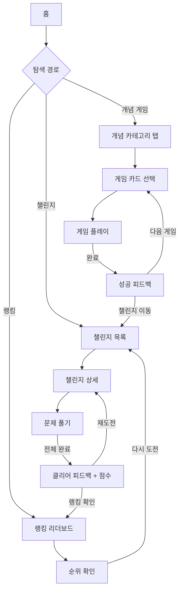

# zMath — UX Flow

## 유저 시나리오

### 시나리오 1: 수포자의 첫 방문 → 개념 게임 플레이

- **사용자**: 수학이 어렵고 싫지만 앱이 재미있어 보여서 들어온 10대
- **목표**: 부담 없이 하나의 수학 개념을 게임으로 체험한다
- **플로우**:
  1. 홈 진입 → 히어로 섹션에서 "나도 할 수 있다"는 인상을 받음
  2. 개념 카테고리 탭(수와 연산 / 함수 / 도형 / 확률·통계)에서 탭 선택
  3. 게임 카드 중 하나 클릭 → 게임 플레이 페이지 진입
  4. 인트로 설명 → 인터랙션(드래그·클릭·슬라이더)으로 개념 조작
  5. 정답 시 성공 피드백 표시 → "다음 문제" 또는 "개념 목록으로"
- **성공 조건**: 게임 1회 완주, 개념을 "그렇구나" 수준으로 이해
- **예외 상황**: 게임 도중 이탈 → 진행 상태 저장 없이 처음부터 (로그인 없음)

---

### 시나리오 2: 챌린지 참여 → 완료 피드백

- **사용자**: 게임을 몇 번 해본 10대, 더 도전적인 것을 찾는 중
- **목표**: 현재 진행 중인 챌린지에 참여하고 클리어한다
- **플로우**:
  1. GNB 또는 홈 챌린지 섹션에서 챌린지 목록 진입
  2. 난이도·기간 정보 확인 후 챌린지 카드 선택
  3. 문제 풀기 → 단계별 진행률 표시
  4. 전 문제 완료 → 클리어 피드백 (점수·등급 표시)
  5. "랭킹 확인" CTA로 랭킹 페이지 이동
- **성공 조건**: 챌린지 완료 + 점수 획득
- **예외 상황**: 중간 이탈 → 세션 내 임시 저장(로컬스테이트), 재진입 시 이어서 가능

---

### 시나리오 3: 랭킹 확인 → 경쟁 동기 부여

- **사용자**: 챌린지를 완료한 사용자, 또는 순위가 궁금한 방문자
- **목표**: 내 점수와 전체 순위를 확인하고 다시 도전 의욕을 얻는다
- **플로우**:
  1. 랭킹 페이지 진입 (GNB 또는 챌린지 완료 CTA)
  2. 리더보드 확인 (닉네임·점수·스트릭)
  3. "다시 도전" CTA → 챌린지 목록으로 이동
- **성공 조건**: 순위 인지 → 재도전 의욕 생성
- **예외 상황**: 비로그인 상태 → 닉네임은 세션 임시값으로 표시

---

## UX 플로우



---

## 정보 구조 (IA)

```
zMath
├── 홈 (/)
│   ├── 히어로 섹션
│   ├── 개념 게임 섹션 (탭 + 카드 그리드)
│   ├── 챌린지 미리보기 (진행 중 챌린지 top 3)
│   └── 랭킹 스니펫 (top 5)
├── 게임 (/games)
│   ├── 카테고리 탭 (수와 연산 / 함수 / 도형 / 확률·통계)
│   ├── 게임 목록 (카드 그리드)
│   └── 게임 플레이 (/games/:conceptId)
│       ├── 인트로 설명
│       ├── 인터랙션 영역 (시각화 + 조작)
│       └── 피드백 (정답/오답/완료)
├── 챌린지 (/challenges)
│   ├── 챌린지 목록 (진행중 / 예정 / 완료)
│   └── 챌린지 플레이 (/challenges/:id)
│       ├── 문제 뷰 + 진행률 바
│       └── 클리어 피드백
└── 랭킹 (/ranking)
    ├── 리더보드 (전체 / 주간)
    └── 재도전 CTA
```

---

## 데이터 모델

| 엔티티 | 주요 필드 | 관계 |
|--------|----------|------|
| Concept | id, category, title, description, difficulty | 1 → N Game |
| Game | id, conceptId, **conceptKey**, type(drag/click/slider), steps[], **views**, **likes**, **lastPlayedAt**, **isPlayed**, **userId** | N → 1 Concept |
| Challenge | id, title, level, period, questionIds[], participants, **correctRate**, **isAttempted**, **isCorrect**, **recommendReason** | N → M Question |
| Question | id, conceptId, prompt, options, answer | — |
| RankEntry | sessionId, nickname, score, streak, challengeId | N → 1 Challenge |

> 로그인 없음 — sessionId는 브라우저 세션 임시 ID

### 게임 카드 인게이지먼트 필드 (Game)

| 필드 | 타입 | 설명 |
|------|------|------|
| `views` | number | 누적 조회수. 카드 클릭(게임 진입) 횟수 합산 |
| `likes` | number | 좋아요 수. 세션별 토글 (로그인 없음, sessionId 기반) |
| `lastPlayedAt` | ISO 8601 string \| null | 현재 세션에서 마지막으로 플레이한 시각. 미플레이 시 null |

**표시 규칙**
- `views`: `1.2k` 포맷 (1000 미만 → 숫자, 이상 → 소수점 1자리 + k)
- `likes`: 좋아요 아이콘 버튼(토글). 카드 클릭과 별도 이벤트 (`onLike`, `e.stopPropagation`)
- `lastPlayedAt`: 상대 시각 — "N분 전" / "오늘 HH:MM" / "어제" / "N일 전"

### 챌린지 카드 추천 필드 (Challenge)

| 필드 | 타입 | 설명 |
|------|------|------|
| `correctRate` | number (0–100) | 전체 정답률. "N명 중 M명만 맞혔어요"로 서사 표현 |
| `isAttempted` | boolean | 현재 세션 사용자가 도전했는지 여부 |
| `isCorrect` | boolean | 도전 후 정답 여부 (`isAttempted=true`일 때만 유효) |
| `recommendReason` | string \| null | 추천 이유 — 공부한 개념 기반 ("약수와 배수를 공부했다면") |

**추천 섹션 원칙**
- 홈 챌린지 섹션 타이틀: **"내게 맞는 챌린지"** (진행 중이 아닌 추천 기반)
- 사용자가 플레이한 게임의 개념과 카테고리 연결
- 내 정답률과 유사한 난이도 우선 노출
- `recommendReason`으로 추천 근거를 카드에 직접 명시

---

## 컴포넌트 리스트

| 컴포넌트 | 용도 | 구분 | 기존 경로 / 비고 |
|----------|------|------|-----------------|
| AppShell | 전체 앱 셸 (GNB + 콘텐츠) | 재활용 | `components/layout/AppShell.jsx` |
| GNB | 상단 글로벌 네비게이션 | 재활용 | `components/navigation/GNB.jsx` |
| PageContainer | 반응형 페이지 래퍼 | 재활용 | `components/layout/PageContainer.jsx` |
| SectionContainer | 섹션 구분 래퍼 | 재활용 | `components/container/SectionContainer.jsx` |
| CategoryTab | 개념 카테고리 탭 | 재활용 | `components/in-page-navigation/CategoryTab.jsx` |
| BentoGrid | 게임 카드 그리드 레이아웃 | 재활용 | `components/layout/BentoGrid.jsx` |
| CardContainer | 게임·챌린지 카드 기본 셸 | 재활용 | `components/card/CardContainer.jsx` |
| CustomCard | 챌린지 카드 (미디어+콘텐츠) | 재활용 | `components/card/CustomCard.jsx` |
| FadeTransition | 페이지·섹션 진입 페이드 | 재활용 | `components/motion/FadeTransition.jsx` |
| Button (MUI) | 전반적 CTA 버튼 | 재활용 | MUI Button |
| LinearProgress (MUI) | 챌린지 진행률 바 | 재활용 | MUI LinearProgress |
| GameCanvas | 수학 개념 시각화 + 인터랙션 영역 | 신규 | 카테고리: `components/game/` |
| ConceptGameCard | 게임 카드 (썸네일·난이도·개념명) | 신규 | 카테고리: `components/game/` |
| ChallengeCard | 챌린지 카드 (기간·레벨·진행률) | 신규 | 카테고리: `components/challenge/` |
| ClearFeedback | 클리어 완료 피드백 오버레이 | 신규 | 카테고리: `components/challenge/` |
| Leaderboard | 랭킹 리더보드 테이블 | 신규 | 카테고리: `components/ranking/` |
